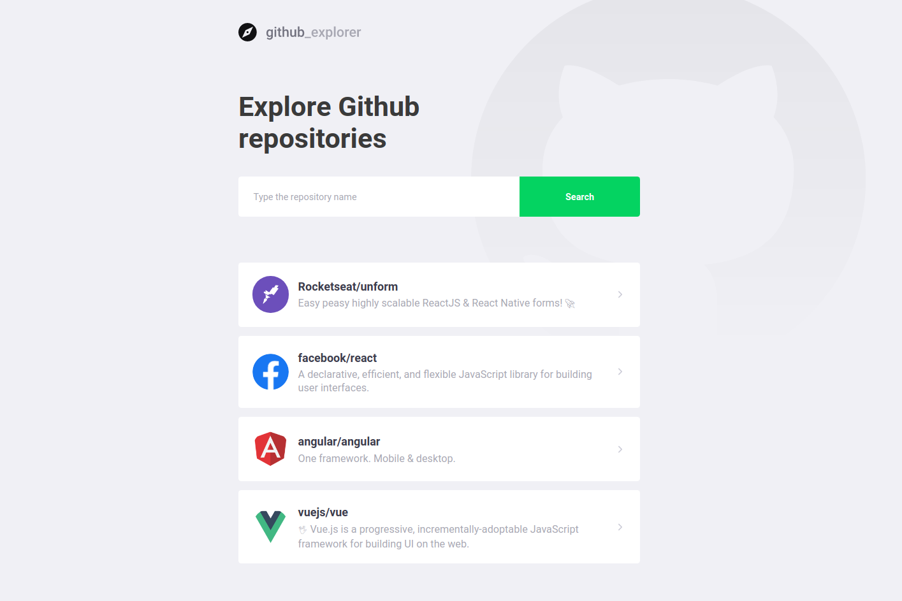
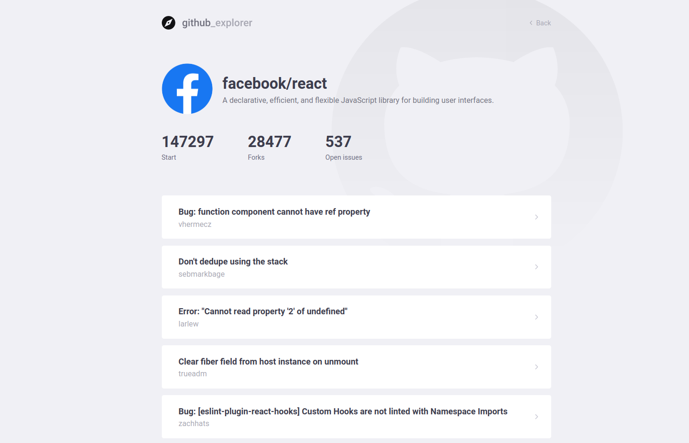

<h1 align="center">
  
</h1>

<h1 align="center">
  <p style="text-align: center">Main page</p>

  
</h1>

<h1 align="center">
  <p style="text-align: center">Repositories page</p>

  
</h1>


# Summary

- [About](#-About)
- [Technologies used](#-Technologies-used)
- [How to get and use the project?](#-How-to-get-and-use-the-project?)

---


# :scroll: About

This is a simple application that returns repositories from a specific user from Github. You can also explore some especific repository from the user.

---

# :computer: Technologies used

- [TypeScript](https://www.typescriptlang.org/)
- [ReactJS](https://github.com/facebook/react)

---

# :octocat: How to get and use the project?

```bash

  #Here you're cloning the repository
  $ git clone https://github.com/AndrioC/github-explorer.git

  #Here you're get into the repository folder 
  $ cd git-hub-explorer

  #Here you're installing all the required dependencies to run the project
  $ yarn install

  #Here you're running the project (a web page will be shown)
  $ yarn start
```

---
<p style="text-align: center">Developed by  Andrio Corrêa :man_technologist:</p>
	